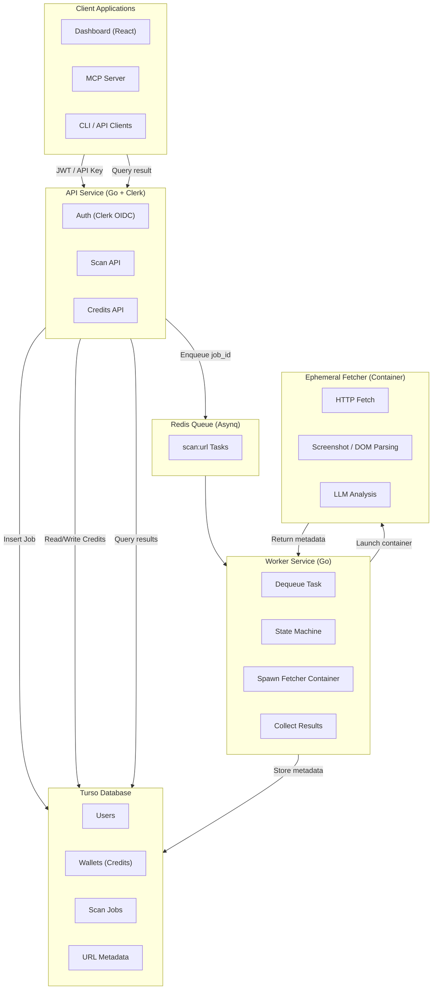
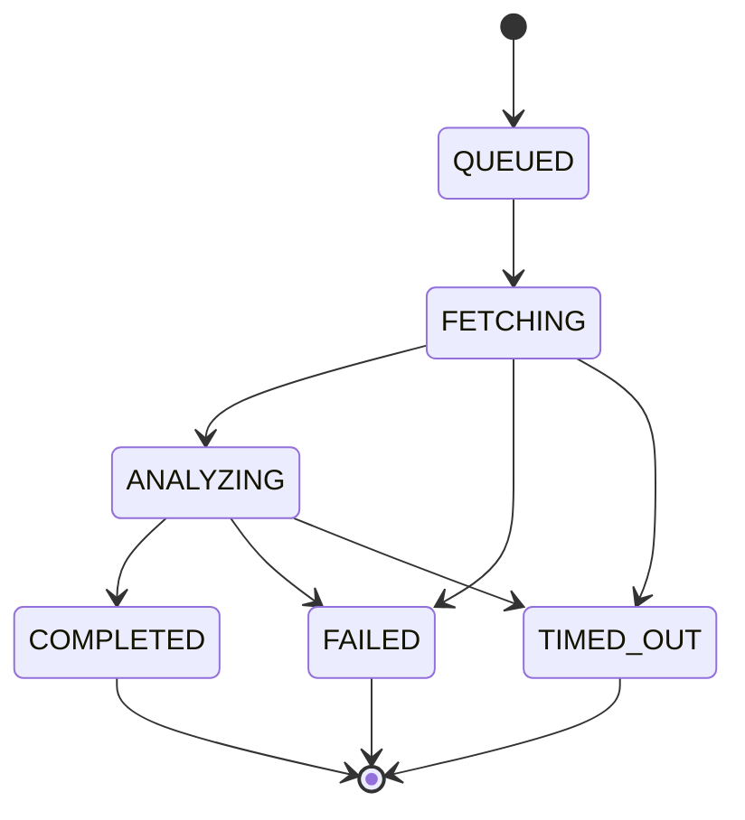
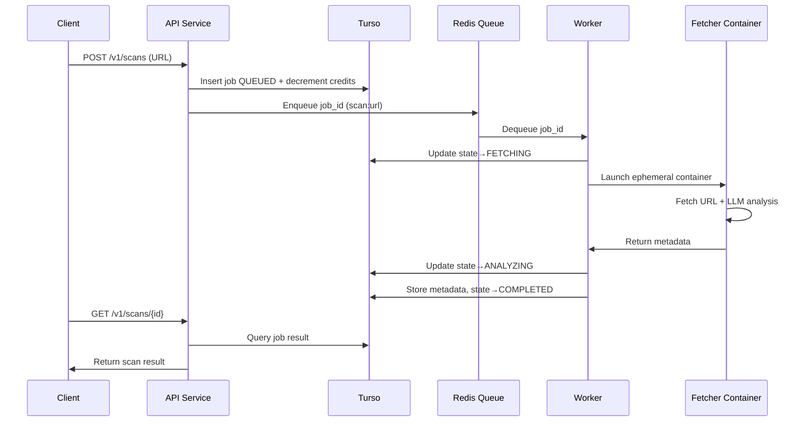

# SafeURL.ai — System Architecture

SafeURL.ai is an open-source, asynchronous, AI-powered URL safety screening service built with isolation, privacy, and developer-friendliness at its core.
It evaluates URLs using ephemeral containers, LLM analysis, and a Redis-backed job queue, while persisting only metadata in Turso.

⸻

## 1. Goals & Requirements

### Core Product Goals

- AI-driven, high-quality URL safety assessment.
- Designed for privacy: no content persisted, metadata only.
- Robust asynchronous workflow with queue + worker system.
- Ephemeral, isolated URL fetch execution for security.
- Fully containerized architecture.
- Developer-friendly API, CLI, and MCP server.

### Technical Requirements

- Open-source with IP-protective license (recommended: BSL).
- OAuth2/OIDC authentication via Clerk.
- Primary DB: Turso (libSQL) for global low-latency access.
- Queue: Redis using Asynq.
- Workers and fetcher implemented in Go.
- Dashboard + MCP server in TypeScript.
- Pluggable LLM providers (OpenAI, DeepSeek, Kami, OSS models).
- Crypto payments + credit-based billing.
- Local development using Docker + Tilt.

⸻

## 2. High-Level Architecture



⸻

## 3. Component Breakdown

### 3.1 API Service (Go)

**Responsibilities:**

- Validates Clerk-issued JWTs.
- Exposes:

* POST /v1/scans
* GET /v1/scans/:id
* credit balance endpoints
* webhook management
  - Writes job rows to Turso.
  - Pushes queued tasks into Redis.
  - Stateless, horizontally scalable.

⸻

### 3.2 Turso Database (libSQL)

**Stores durable state:**

- Users (Clerk user IDs)
- Credits (wallets)
- Scan jobs + state
- Result metadata:

* categories
* risk score
* model used
* content_hash
* http status, headers, etc.

All transitions use optimistic concurrency to preserve state integrity.

⸻

### 3.3 Redis Queue (Asynq)

**Handles async workflow:**

- Job dispatch (scan:url)
- Retries + exponential backoff
- Dead-letter queues
- Visibility timeouts
- Horizontal scaling via worker concurrency

**SaaS-friendly:** Upstash / Redis Cloud.

⸻

### 3.4 Worker Service (Go)

**Key functions:**

- Dequeues tasks from Redis.
- Claims scan job from Turso.
- Performs state transitions:

* QUEUED → FETCHING
* FETCHING → ANALYZING
* ANALYZING → COMPLETED
  - Spawns ephemeral fetcher containers using Docker SDK.
  - Collects fetcher results & LLM output.
  - Stores metadata in Turso.

⸻

### 3.5 Ephemeral Fetcher Container (Go binary)

Launched per scan.

**Inside the container:**

- Strict-timeout URL fetcher
- SSRF-safe networking
- Optional screenshot or rendered DOM extraction
- LLM provider call via adapters
- Output returned via:

* stdout JSON, or
* internal service callback

Container always runs as `--rm`, leaving no state behind.

⸻

### 3.6 LLM Provider Adapter Layer

**Unified interface:**

```go
type AIClient interface {
    AnalyzeURL(ctx context.Context, fetch FetchResult) (AnalysisResult, error)
}
```

**Providers:**

- OpenAI (Vision)
- DeepSeek
- Kami
- Ollama (local)
- Custom threat-model fine-tuned LLMs

⸻

### 3.7 Dashboard (Next.js + Clerk)

**Provides:**

- Scan history
- Real-time job updates
- API keys
- Credit balance
- Crypto payments
- Developer tools

⸻

### 3.8 MCP Server (TypeScript)

**Tools for agents & dev tools:**

- `scan_url(url)`
- `get_scan_status(jobId)`
- `get_url_report(jobId)`

Thin wrapper over the public API.

⸻

## 4. State Machine



**Rules:**

- Only valid transitions allowed.
- Prevents concurrency races between workers.
- Each step is updated atomically via Turso.

⸻

## 5. Job Lifecycle (Sequence)



⸻

## 6. Development Environment

### Tools

- Docker
- Tilt (live reload)
- Turso local dev
- Redis local container
- Go services (API, worker, fetcher)
- Next.js dashboard
- MCP server (Node)

### Local services via Tilt

- localhost:8080 — API
- localhost:3000 — Dashboard
- localhost:6379 — Redis
- turso file — local database

⸻

## 7. Licensing

**Recommended:**

**Business Source License (BSL 1.1)**

- Protects SaaS offering
- Source available for all users
- Automatically becomes Apache 2.0 after X years

⸻

## 8. Future Extensions

- Batch scanning endpoints
- Domain intelligence & aggregated risk scoring
- Browser extension for real-time scanning
- SIEM / SOC integrations
- Attachment/file scanning
- Custom fine-tuned LLM optimized for web threat detection
- Queue partitioning for high-volume enterprise customers

⸻

## 9. Proposed Repository Structure

```
safeurl/
├── api/              # Go HTTP API
├── worker/           # Go worker + Asynq
├── fetcher/          # Ephemeral fetcher (Go)
├── dashboard/        # Next.js + Clerk
├── mcp-server/       # TypeScript MCP implementation
├── db/               # Turso schema + migrations
├── infra/
│   ├── docker/
│   ├── tilt/
│   └── k8s/
└── docs/
    └── safeurl_architecture.md
```
