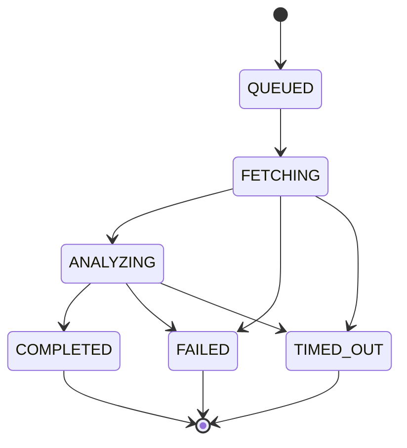
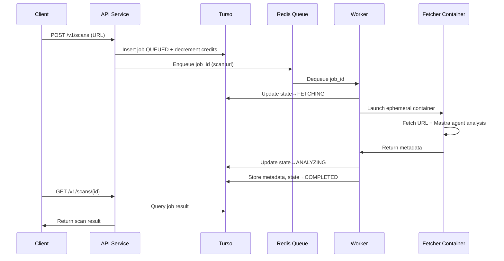

# SafeURL.ai — System Architecture

SafeURL.ai is an open-source, asynchronous, AI-powered URL safety screening service built with isolation, privacy, and developer-friendliness at its core.
It evaluates URLs using ephemeral containers, LLM analysis, and a Redis-backed job queue, while persisting only metadata in Turso.

---

## 1. Goals & Requirements

### Core Product Goals

- AI-driven, high-quality URL safety assessment.
- Designed for privacy: no content persisted, metadata only.
- Compliance-first: Comprehensive audit logging without storing unsafe/illegal content.
- Robust asynchronous workflow with queue + worker system.
- Ephemeral, isolated URL fetch execution for security.
- Fully containerized architecture.
- Developer-friendly API, CLI, and MCP server.

### Technical Requirements

- Open-source with IP-protective license (recommended: BSL).
- OAuth2/OIDC authentication via Clerk.
- Primary DB: Turso (libSQL) with Drizzle ORM for type-safe, schema-driven access.
- Queue: Redis using BullMQ (Bun-compatible).
- Runtime validation: Zod schemas for type-safe API inputs/outputs, database validation, and cross-service contracts.
- Functional error handling: neverthrow for explicit, type-safe error handling with `Result<T, E>` types.
- All services implemented in TypeScript/Bun (API, workers, fetcher).
- Dashboard + MCP server in TypeScript/Bun.
- Mastra framework for agentic capabilities and LLM provider abstraction.
- Pluggable LLM providers via Mastra (OpenAI, Anthropic, Google, DeepSeek, Kami, Ollama, and 600+ models).
- Crypto payments + credit-based billing.
- Local development using Docker + Tilt.

---

## 2. High-Level Architecture


---

## 3. Component Breakdown

### 3.1 API Service (Bun + TypeScript)

**Responsibilities:**

- Validates Clerk-issued JWTs.
- Exposes:

* POST /v1/scans
* GET /v1/scans/:id
* credit balance endpoints
* webhook management
  - Writes job rows to Turso via Drizzle ORM.
  - Pushes queued tasks into Redis (BullMQ).
  - Stateless, horizontally scalable.
  - Built with Bun's native HTTP server for high performance.
  - Type-safe database operations with Drizzle's TypeScript-first API.
  - Runtime request/response validation using Zod schemas from `@safeurl/core`.
  - Validates all API inputs and outputs for type safety and security.
  - Functional error handling with neverthrow `Result<T, E>` types.
  - All failable operations return `Result` or `ResultAsync`, making errors explicit and type-safe.

---

### 3.2 Turso Database (libSQL + Drizzle ORM)

**Stores durable state:**

- Users (Clerk user IDs)
- Credits (wallets)
- Scan jobs + state
- Result metadata:

* categories
* risk score
* model used
* content_hash
* http status, headers, etc.

- **Audit logs** (separate, append-only storage):
  - URL accessed (metadata only)
  - Timestamp
  - Content hash (for verification, not content itself)
  - Risk assessment results
  - Scan job ID
  - HTTP status and headers
  - Content type (MIME type only)

**Database Layer:**

- Drizzle ORM for type-safe, schema-driven database access
- Schema migrations managed via Drizzle Kit
- Full TypeScript type inference for queries and results
- Optimistic concurrency control via Drizzle transactions
- libSQL driver for Turso compatibility
- Global low-latency access via Turso's edge replication
- **Separate audit log storage**: Append-only, immutable audit trail for compliance
- **Content exclusion**: Audit logs explicitly exclude actual content bodies to prevent unsafe/illegal material persistence

All state transitions use Drizzle transactions with optimistic concurrency to preserve state integrity.
Audit logs are written atomically and are read-only after creation to ensure compliance and prevent tampering.

---

### 3.3 Redis Queue (BullMQ)

**Handles async workflow:**

- Job dispatch (scan:url)
- Retries + exponential backoff
- Dead-letter queues
- Visibility timeouts
- Horizontal scaling via worker concurrency
- TypeScript-first API, fully compatible with Bun

**SaaS-friendly:** Upstash / Redis Cloud.

---

### 3.4 Worker Service (Bun + TypeScript + Mastra)

**Key functions:**

- Dequeues tasks from Redis (BullMQ).
- Claims scan job from Turso via Drizzle ORM.
- Performs state transitions:

* QUEUED → FETCHING
* FETCHING → ANALYZING
* ANALYZING → COMPLETED
  - Spawns ephemeral fetcher containers using Docker SDK (via `dockerode` or Bun-native Docker API).
  - Collects fetcher results & Mastra agent analysis output.
  - Validates all data using Zod schemas from `@safeurl/core` before processing.
  - Stores metadata in Turso using Drizzle ORM with type safety.
  - Leverages Bun's fast runtime and native async capabilities.
  - Uses Mastra for agent orchestration and LLM provider management.
  - Error handling via neverthrow `ResultAsync` for composable async error handling.
  - All operations chain with `.andThen()`, `.map()`, and `.orElse()` for explicit error propagation.

---

### 3.5 Ephemeral Fetcher Container (Bun + TypeScript + Mastra)

Launched per scan.

**Inside the container:**

- Strict-timeout URL fetcher (using Bun's native fetch)
- SSRF-safe networking
- Optional screenshot or rendered DOM extraction (via Puppeteer/Playwright)
- Mastra agent for URL safety analysis with structured output
- Mastra tools for content extraction and threat detection
- Validates all outputs using Zod schemas from `@safeurl/core` before returning
- All failable operations return `Result<T, E>` types for explicit error handling
- **Compliance audit logging**: Immutable audit trail of all content accessed
- Output returned via:

* stdout JSON, or
* internal service callback

**Audit Logging for Compliance:**

The fetcher maintains comprehensive audit logs to ensure compliance and prevent damage from unsafe or illegal content:

- **What is logged**: Metadata only (URL accessed, timestamp, HTTP status, content type, content hash, risk assessment, scan job ID)
- **What is NOT logged**: Actual content body, screenshots, or any potentially unsafe/illegal material
- **Purpose**:
  - Legal protection: Proof of what was accessed without storing illegal content
  - Compliance: Audit trail for regulatory requirements (GDPR, SOC 2, etc.)
  - Damage prevention: Ensures no unsafe content is ever persisted to disk or database
  - Accountability: Track which URLs were scanned and when, without storing their content
- **Storage**: Audit logs are written to secure, append-only storage (separate from main database)
- **Retention**: Configurable retention policies for compliance requirements
- **Access**: Audit logs are read-only and can only be accessed by authorized compliance/security personnel

Container always runs as `--rm`, leaving no state behind.
Built with Bun for fast startup and execution.
Uses Mastra agents for intelligent, multi-step URL analysis with tool calling capabilities.
Error handling uses neverthrow for type-safe error propagation without exceptions.

**Privacy-First Design**: The fetcher's audit logging ensures we can prove what was scanned for legal/compliance purposes while maintaining our core privacy principle: **no content is ever persisted, only metadata**.

---

### 3.6 Mastra Agent Framework

**Agent-based URL Analysis:**

Mastra provides a unified framework for agentic URL safety analysis with support for 600+ LLM models across multiple providers.

**Core Components:**

- **URL Safety Agent**: Mastra agent configured with specialized instructions for threat detection
- **Structured Output**: Zod schemas for consistent risk scoring and categorization
- **Tool Integration**: Mastra tools for content extraction, screenshot analysis, and threat pattern detection
- **Multi-step Reasoning**: Agent can perform iterative analysis with tool calling
- **Provider Abstraction**: Seamless switching between LLM providers

**Supported Providers (via Mastra):**

- OpenAI (GPT-4o, GPT-4 Vision, GPT-4o-mini)
- Anthropic (Claude Sonnet, Claude Opus)
- Google (Gemini Pro, Gemini Flash)
- DeepSeek
- Kami
- Ollama (local models)
- Custom fine-tuned models via Mastra's provider abstraction

**Example Agent Configuration:**

```typescript
import { Agent } from "@mastra/core/agent";
import { openai } from "@ai-sdk/openai";
import { z } from "zod";

export const urlSafetyAgent = new Agent({
  name: "url-safety-agent",
  instructions: `
    You are an expert URL safety analyst. Analyze URLs for:
    - Phishing attempts
    - Malware distribution
    - Scam patterns
    - Suspicious redirects
    - Content safety
  `,
  model: openai("gpt-4o"),
  tools: {
    extractContent: contentExtractionTool,
    analyzeScreenshot: screenshotAnalysisTool,
    checkReputation: reputationCheckTool,
  },
});
```

**Structured Analysis Output:**

```typescript
const analysisSchema = z.object({
  riskScore: z.number().min(0).max(100),
  categories: z.array(
    z.enum(["phishing", "malware", "scam", "suspicious", "safe"])
  ),
  confidence: z.number().min(0).max(1),
  reasoning: z.string(),
  indicators: z.array(z.string()),
});
```

All agent interactions leverage Mastra's streaming, memory, and observability features for production-grade reliability.

---

### 3.7 Functional Error Handling (neverthrow)

**Practical Functional Programming for Failable States:**

SafeURL uses [neverthrow](https://www.solberg.is/neverthrow) for explicit, type-safe error handling. Instead of throwing exceptions, all failable operations return `Result<T, E>` or `ResultAsync<T, E>` types, making errors first-class citizens in the type system.

**Core Principles:**

- **Explicit Errors**: All potential failures are encoded in function return types
- **Type Safety**: Error types are discriminated unions, enabling exhaustive error handling
- **Composability**: Chain operations with `.andThen()`, `.map()`, `.orElse()` without losing type information
- **No Implicit Control Flow**: Errors don't escape via exceptions - they must be handled explicitly

**Integration with Zod:**

```typescript
import { err, ok, type Result } from "neverthrow";
import { z } from "zod";

interface ZodParseError<T> {
  type: "zod";
  errors: z.ZodError<T>;
}

export function safeZodParse<TSchema extends z.ZodSchema>(
  schema: TSchema
): (
  data: unknown
) => Result<z.infer<TSchema>, ZodParseError<z.infer<TSchema>>> {
  return (data: unknown) => {
    const result = schema.safeParse(data);
    return result.success
      ? ok(result.data)
      : err({ type: "zod", errors: result.error });
  };
}
```

**Safe Fetch with Error Discrimination:**

```typescript
import { ResultAsync, err } from "neverthrow";

type FetchError<E> = NetworkError | HttpError<E> | ParseError;

interface NetworkError {
  type: "network";
  error: Error;
}

interface HttpError<E = unknown> {
  type: "http";
  status: number;
  headers: Headers;
  json?: E;
}

interface ParseError {
  type: "parse";
  error: Error;
}

export function safeFetch<T = unknown, E = unknown>(
  input: URL | string,
  init?: RequestInit
): ResultAsync<T, FetchError<E>> {
  return ResultAsync.fromPromise(
    fetch(input, init),
    (error): NetworkError => ({
      type: "network",
      error: error instanceof Error ? error : new Error(String(error)),
    })
  ).andThen((response) => {
    if (!response.ok) {
      return ResultAsync.fromSafePromise(
        response.json().catch(() => undefined)
      ).andThen((json) =>
        err({
          type: "http",
          status: response.status,
          headers: response.headers,
          json: json as E,
        })
      );
    }

    return ResultAsync.fromPromise(
      response.json() as Promise<T>,
      (error): ParseError => ({
        type: "parse",
        error: error instanceof Error ? error : new Error(String(error)),
      })
    );
  });
}
```

**Composing Operations:**

```typescript
const result = await safeFetch(`/users/${id}`)
  .andThen(safeZodParse(userSchema))
  .map((user) => user.id)
  .orTee(logError)
  .andTee(queueEmailNotification);

if (result.isErr()) {
  switch (result.error.type) {
    case "network":
      retryWithToast(result.error.error);
      break;
    case "http":
      trackAnalytics(result.error.status);
      break;
    case "parse":
      logError(result.error.error);
      break;
    case "zod":
      showFormErrors(result.error.errors);
      break;
  }
} else {
  displayUser(result.value);
}
```

**Benefits:**

- **Type Safety**: TypeScript exhaustively checks error handling
- **Explicit Error Handling**: No hidden exception paths
- **Composability**: Chain operations without losing error context
- **Better DX**: Clear error types enable better error messages and recovery strategies
- **Testability**: Easy to test both success and error paths

All services (API, Worker, Fetcher) use neverthrow for consistent, type-safe error handling across the codebase.

---

### 3.8 Dashboard (Next.js + Clerk + Bun)

**Provides:**

- Scan history
- Real-time job updates
- API keys
- Credit balance
- Crypto payments
- Developer tools

Runs on Bun runtime for optimal performance and fast hot reloading.

---

### 3.9 MCP Server (Bun + TypeScript)

**Tools for agents & dev tools:**

- `scan_url(url)`
- `get_scan_status(jobId)`
- `get_url_report(jobId)`

Thin wrapper over the public API.
Built with Bun for fast startup and low latency.

---

## 4. State Machine



**Rules:**

- Only valid transitions allowed.
- Prevents concurrency races between workers.
- Each step is updated atomically via Drizzle transactions in Turso.

---

## 5. Job Lifecycle (Sequence)



---

## 6. Development Environment

### Tools

- Docker
- Tilt (live reload)
- Turso local dev
- Redis local container
- Bun runtime (all services: API, worker, fetcher)
- Mastra framework for agentic capabilities
- Next.js dashboard (Bun runtime)
- MCP server (Bun)

### Local services via Tilt

- localhost:8080 — API
- localhost:3000 — Dashboard
- localhost:6379 — Redis
- turso file — local database

---

## 7. Licensing

**Recommended:**

**Business Source License (BSL 1.1)**

- Protects SaaS offering
- Source available for all users
- Automatically becomes Apache 2.0 after X years

---

## 8. Future Extensions

- Batch scanning endpoints
- Domain intelligence & aggregated risk scoring
- Browser extension for real-time scanning
- SIEM / SOC integrations
- Attachment/file scanning
- Custom fine-tuned LLM optimized for web threat detection
- Queue partitioning for high-volume enterprise customers

---

## 9. Proposed Repository Structure

Bun monorepo with `apps/` and `packages/` workspaces:

```
safeurl/
├── apps/
│   ├── api/              # Bun HTTP API (TypeScript)
│   ├── worker/           # Bun worker + BullMQ (TypeScript)
│   ├── fetcher/          # Ephemeral fetcher (Bun + TypeScript + Mastra)
│   ├── dashboard/        # Next.js + Clerk (Bun runtime)
│   └── mcp-server/       # Bun MCP server (TypeScript)
├── packages/
│   ├── core/             # Core shared package (@safeurl/core)
│   │   ├── schemas/      # Zod schemas for runtime validation
│   │   │   ├── api/      # API request/response schemas
│   │   │   ├── scan/     # Scan job schemas
│   │   │   ├── user/     # User & auth schemas
│   │   │   └── index.ts
│   │   ├── result/       # neverthrow utilities & helpers
│   │   │   ├── safe-fetch.ts    # Safe fetch with Result types
│   │   │   ├── safe-zod.ts     # Zod integration with Result
│   │   │   ├── safe-db.ts      # Database operation wrappers
│   │   │   └── index.ts
│   │   ├── audit/         # Audit logging utilities
│   │   │   ├── logger.ts       # Audit log writer
│   │   │   ├── schemas.ts      # Audit log schemas (Zod)
│   │   │   └── index.ts
│   │   ├── types/         # Shared TypeScript types
│   │   ├── utils/         # Shared utility functions
│   │   ├── libs/          # Shared libraries (validators, formatters, etc.)
│   │   ├── config/        # Shared configuration schemas & defaults
│   │   └── index.ts       # Public API exports
│   ├── db/               # Drizzle schema + migrations (Turso/libSQL)
│   └── mastra/           # Mastra agents, tools, and workflows
│       ├── agents/
│       │   └── url-safety-agent.ts
│       ├── tools/
│       │   ├── content-extraction.ts
│       │   ├── screenshot-analysis.ts
│       │   └── reputation-check.ts
│       └── index.ts
├── infra/
│   ├── docker/
│   ├── tilt/
│   └── k8s/
├── docs/
│   └── safeurl_architecture.md
├── package.json          # Root workspace config
└── bun.lockb            # Bun lockfile
```

**Core Package (`@safeurl/core`):**

The `core` package provides shared runtime validation, types, utilities, and configuration used across all apps:

- **Zod Schemas**: Centralized runtime validation schemas for:
  - API request/response validation
  - Scan job state transitions
  - User authentication & authorization
  - Queue job payloads
  - Database entity validation
- **Result Utilities**: neverthrow wrappers and helpers:
  - `safeFetch`: Type-safe HTTP client returning `ResultAsync<T, FetchError>`
  - `safeZodParse`: Zod schema validation returning `Result<T, ZodError>`
  - `safeDb`: Database operation wrappers with Result types
  - Error type definitions and discriminated unions
- **Audit Logging**: Compliance and security audit utilities:
  - Audit log writer with append-only guarantees
  - Zod schemas for audit log entries (metadata only, no content)
  - Secure storage integration for compliance retention
  - Content hash generation for verification without storing content
- **Types**: Shared TypeScript types derived from Zod schemas and Result types
- **Utils**: Common utility functions (validators, formatters, error handlers)
- **Libs**: Reusable libraries (HTTP clients, parsers, transformers)
- **Config**: Environment configuration schemas with validation

All apps import from `@safeurl/core` to ensure consistent validation, type safety, and functional error handling across the monorepo. Error handling follows the neverthrow pattern, making all failures explicit and type-safe.
