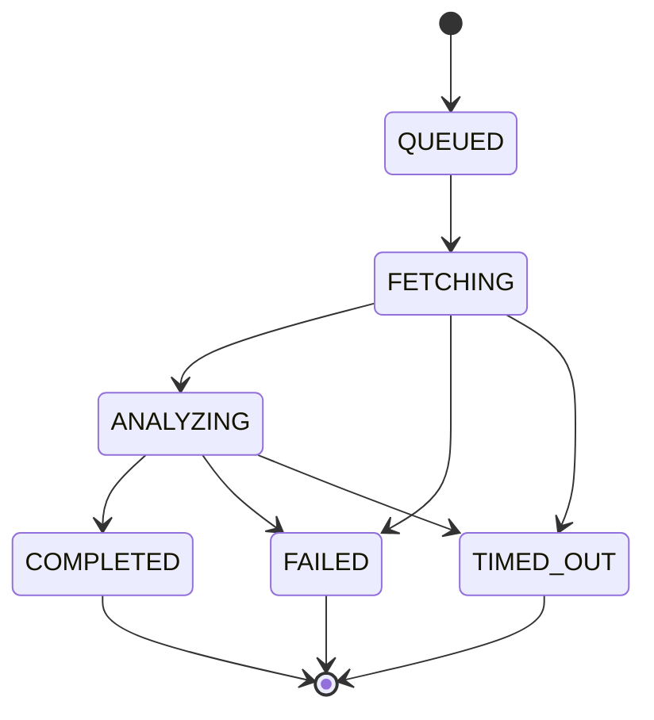
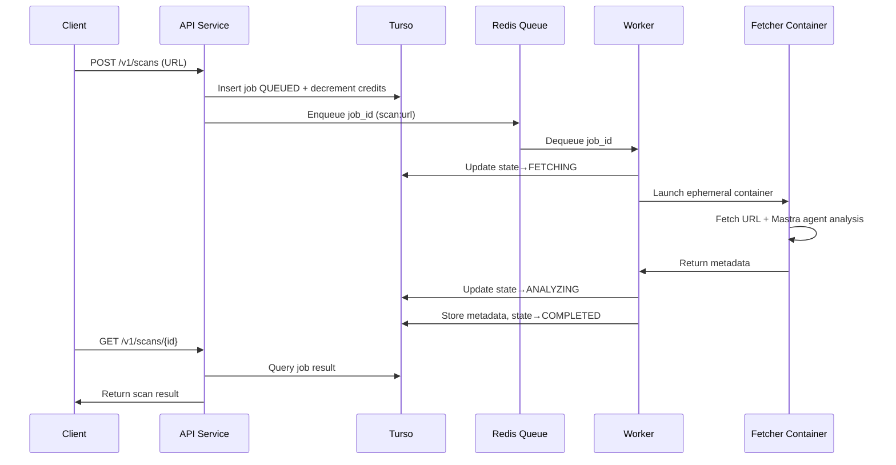

# SafeURL.ai — System Architecture

SafeURL.ai is an open-source, asynchronous, AI-powered URL safety screening service built with isolation, privacy, and developer-friendliness at its core.
It evaluates URLs using ephemeral containers, LLM analysis, and a Redis-backed job queue, while persisting only metadata in Turso.

---

## 1. Goals & Requirements

### Core Product Goals

- AI-driven, high-quality URL safety assessment.
- Designed for privacy: no content persisted, metadata only.
- Compliance-first: Comprehensive audit logging without storing unsafe/illegal content.
- Robust asynchronous workflow with queue + worker system.
- Ephemeral, isolated URL fetch execution for security.
- Fully containerized architecture.
- Developer-friendly API, CLI, and MCP server.

### Technical Requirements

- Open-source with IP-protective license (recommended: BSL).
- OAuth2/OIDC authentication via Clerk.
- Primary DB: Turso (libSQL) with Drizzle ORM for type-safe, schema-driven access.
- Queue: Redis using BullMQ (Bun-compatible).
- Runtime validation: Zod schemas for type-safe API inputs/outputs, database validation, and cross-service contracts.
- Functional error handling: neverthrow for explicit, type-safe error handling with `Result<T, E>` types.
- All services implemented in TypeScript/Bun (API, workers, fetcher).
- Dashboard + MCP server in TypeScript/Bun.
- **API Framework: ElysiaJS** - Fast, type-safe web framework built for Bun with excellent TypeScript inference and plugin ecosystem.
- Mastra framework for agentic capabilities and LLM provider abstraction.
- Pluggable LLM providers via Mastra (OpenAI, Anthropic, Google, DeepSeek, Kami, Ollama, and 600+ models).
- Crypto payments + credit-based billing.
- Local development using Docker + Tilt.

### Performance Requirements

- **API Response Times**:
  - Non-scan endpoints (GET, status checks): < 200ms p95
  - Scan creation (POST /v1/scans): < 500ms p95
  - Result retrieval: < 200ms p95
- **Worker Processing**:
  - Job processing latency: < 30s p95 (from QUEUED to COMPLETED)
  - Container startup time: < 2s p95
  - Concurrent job processing: Support 100+ concurrent scans
- **Scalability**:
  - Horizontal scaling for API service (stateless design)
  - Worker auto-scaling based on queue depth
  - Database connection pooling and edge replication via Turso
- **Throughput**:
  - Support 1000+ scans per minute per worker instance
  - API capable of handling 10,000+ requests per minute

### Security Requirements

- **Authentication & Authorization**:
  - JWT validation for all protected endpoints
  - API key authentication for programmatic access
  - Role-based access control (RBAC) for admin operations
  - Rate limiting per user/API key
- **Input Validation**:
  - SSRF protection: Strict URL validation preventing internal network access
  - URL whitelist/blacklist for known malicious domains
  - Request size limits (max URL length, payload size)
  - Content-Type validation
- **Container Security**:
  - Ephemeral containers with no persistent storage
  - Network isolation (no access to internal services)
  - Resource limits (CPU, memory, timeout)
  - Read-only filesystem where possible
  - Non-root user execution
- **Data Protection**:
  - No content persistence (metadata only)
  - Encrypted audit logs at rest
  - Secure credential management (environment variables, secrets)
  - HTTPS/TLS for all external communications
- **Compliance**:
  - GDPR compliance (right to deletion, data portability)
  - SOC 2 Type II readiness
  - Audit trail immutability
  - Data retention policies

### Reliability Requirements

- **Availability**:
  - 99.9% uptime SLA (target)
  - Graceful degradation during LLM provider outages
  - Health check endpoints for monitoring
- **Error Handling**:
  - Comprehensive error logging and alerting
  - Dead-letter queue for failed jobs
  - Automatic retries with exponential backoff
  - Circuit breakers for external service calls
- **Data Integrity**:
  - Atomic state transitions via database transactions
  - Optimistic concurrency control
  - Idempotent API operations
  - Credit deduction atomicity guarantees

### Developer Experience Requirements

- **API Design**:
  - RESTful API with consistent error responses
  - OpenAPI/Swagger documentation
  - SDK support (TypeScript/JavaScript first)
  - Clear, actionable error messages
- **Documentation**:
  - Comprehensive API documentation
  - Integration guides and examples
  - Architecture decision records (ADRs)
  - Runbook for operations
- **Local Development**:
  - One-command local setup (Docker Compose or Tilt)
  - Hot reloading for all services
  - Mock services for external dependencies
  - Development seed data

---

## 2. High-Level Architecture


---

## 3. Component Breakdown

### 3.1 API Service (ElysiaJS + Bun + TypeScript)

**Responsibilities:**

- Validates Clerk-issued JWTs via ElysiaJS plugins.
- Exposes RESTful API endpoints:

* POST /v1/scans - Create a new URL scan job
* GET /v1/scans/:id - Retrieve scan result by job ID
* GET /v1/scans - List user's scan history (paginated)
* GET /v1/credits/balance - Get current credit balance
* POST /v1/credits/purchase - Purchase credits (crypto payment)
* GET /v1/webhooks - List configured webhooks
* POST /v1/webhooks - Create webhook endpoint
* DELETE /v1/webhooks/:id - Delete webhook
* GET /v1/health - Health check endpoint
* GET /v1/metrics - Prometheus metrics (optional)

- Writes job rows to Turso via Drizzle ORM.
- Pushes queued tasks into Redis (BullMQ).
- Stateless, horizontally scalable design.

**ElysiaJS Framework:**

Built with [ElysiaJS](https://elysiajs.com/quick-start.html) - A fast, type-safe web framework optimized for Bun:

- **Performance**: Optimized for Bun runtime with native performance
- **Type Safety**: Excellent TypeScript inference and compile-time type checking
- **Plugin Ecosystem**: Rich plugin ecosystem for common functionality:
  - `@elysiajs/bearer` - Bearer token authentication
  - `@elysiajs/cors` - CORS configuration
  - `@elysiajs/jwt` - JWT validation (for Clerk integration)
  - `@elysiajs/openapi` - OpenAPI/Swagger documentation generation
  - `@elysiajs/opentelemetry` - OpenTelemetry observability and tracing
  - Custom plugins for rate limiting, logging, etc.
- **Built-in Validation**: Native support for Zod schemas with automatic type inference
- **Lifecycle Hooks**: Request/response lifecycle hooks for middleware and error handling
- **Developer Experience**:
  - Hot reloading with `bun dev` command
  - Clean, intuitive API design
  - Excellent error messages
  - Auto-completion and type inference in IDE

**Example ElysiaJS Setup:**

```typescript
import { Elysia } from "elysia";
import { bearer } from "@elysiajs/bearer";
import { cors } from "@elysiajs/cors";
import { openapi } from "@elysiajs/openapi";
import { opentelemetry } from "@elysiajs/opentelemetry";
import { z } from "zod";
import { createScanRequestSchema } from "@safeurl/core";

const app = new Elysia()
  // OpenAPI documentation (accessible at /openapi)
  .use(
    openapi({
      documentation: {
        info: {
          title: "SafeURL.ai API",
          version: "1.0.0",
          description: "AI-powered URL safety screening service",
        },
        tags: [
          { name: "Scans", description: "URL scanning endpoints" },
          { name: "Credits", description: "Credit management endpoints" },
          { name: "Webhooks", description: "Webhook management endpoints" },
        ],
        components: {
          securitySchemes: {
            bearerAuth: {
              type: "http",
              scheme: "bearer",
              bearerFormat: "JWT",
            },
          },
        },
      },
    })
  )
  // OpenTelemetry for observability
  .use(
    opentelemetry({
      serviceName: "safeurl-api",
      serviceVersion: "1.0.0",
    })
  )
  .use(cors())
  .use(bearer())
  .group(
    "/v1",
    (app) =>
      app
        .post(
          "/scans",
          async ({ body, bearer }) => {
            // Process scan creation...
            return { jobId: "...", status: "QUEUED" };
          },
          {
            body: createScanRequestSchema, // Automatic validation
            detail: {
              summary: "Create a new URL scan job",
              tags: ["Scans"],
              security: [{ bearerAuth: [] }],
            },
          }
        )
        .get(
          "/scans/:id",
          async ({ params }) => {
            // Retrieve scan result...
          },
          {
            detail: {
              summary: "Get scan result by job ID",
              tags: ["Scans"],
              security: [{ bearerAuth: [] }],
            },
          }
        ),
    {
      detail: {
        security: [{ bearerAuth: [] }],
      },
    }
  )
  .listen(8080);
```

**OpenAPI Documentation:**

ElysiaJS automatically generates OpenAPI documentation from your route definitions. See [OpenAPI Patterns](https://elysiajs.com/patterns/openapi.html) for details:

- **Swagger UI**: Available at `/openapi` (interactive documentation)
- **OpenAPI JSON**: Available at `/openapi/json` (machine-readable spec)
- **Zod Integration**: Use `zod-to-json-schema` for Zod schema conversion
- **Route Descriptions**: Use `detail` field to add summaries, tags, and descriptions
- **Security Schemes**: Configure Bearer JWT authentication in OpenAPI config

**OpenTelemetry Observability:**

ElysiaJS supports OpenTelemetry for distributed tracing and observability. See [OpenTelemetry Patterns](https://elysiajs.com/patterns/opentelemetry.html) for setup:

- **Automatic Tracing**: Request/response tracing out of the box
- **Custom Spans**: Add custom spans for business logic
- **Exporters**: Configure exporters for Jaeger, Axiom, Datadog, etc.
- **Performance Monitoring**: Track request latency, error rates, and throughput

**Integration Points:**

- Type-safe database operations with Drizzle's TypeScript-first API.
- Runtime request/response validation using Zod schemas from `@safeurl/core`.
- Validates all API inputs and outputs for type safety and security.
- Functional error handling with neverthrow `Result<T, E>` types.
- All failable operations return `Result` or `ResultAsync`, making errors explicit and type-safe.
- Rate limiting per user/API key to prevent abuse.
- Request logging and structured error responses.
- CORS configuration for dashboard and API clients.

**Development:**

- Start development server: `bun dev` (auto-reloads on file changes)
- Production build: `bun build`
- Type checking: Built-in TypeScript support with ElysiaJS
- API Documentation: Access Swagger UI at `http://localhost:8080/openapi`

**Best Practices:**

Following [ElysiaJS Best Practices](https://elysiajs.com/essential/best-practice.html):

- **Feature-Based Structure**: Organize code by feature modules (scans, credits, webhooks)
- **Separation of Concerns**: Controllers for routing, services for business logic, models for data
- **Type Safety**: Leverage TypeScript inference and Zod schemas for end-to-end type safety
- **Error Handling**: Use neverthrow `Result` types integrated with ElysiaJS error handlers
- **Plugin Composition**: Build reusable plugins for common functionality (auth, validation, etc.)
- **Route Grouping**: Use `.group()` and `.guard()` for organized route hierarchies

---

### 3.2 Turso Database (libSQL + Drizzle ORM)

**Stores durable state:**

- Users (Clerk user IDs)
- Credits (wallets)
- Scan jobs + state
- Result metadata:

* categories
* risk score
* model used
* content_hash
* http status, headers, etc.

- **Audit logs** (separate, append-only storage):
  - URL accessed (metadata only)
  - Timestamp
  - Content hash (for verification, not content itself)
  - Risk assessment results
  - Scan job ID
  - HTTP status and headers
  - Content type (MIME type only)

**Database Layer:**

- Drizzle ORM for type-safe, schema-driven database access
- Schema migrations managed via Drizzle Kit
- Full TypeScript type inference for queries and results
- Optimistic concurrency control via Drizzle transactions
- libSQL driver for Turso compatibility
- Global low-latency access via Turso's edge replication
- **Separate audit log storage**: Append-only, immutable audit trail for compliance
- **Content exclusion**: Audit logs explicitly exclude actual content bodies to prevent unsafe/illegal material persistence

All state transitions use Drizzle transactions with optimistic concurrency to preserve state integrity.
Audit logs are written atomically and are read-only after creation to ensure compliance and prevent tampering.

---

### 3.3 Redis Queue (BullMQ)

**Handles async workflow:**

- Job dispatch (scan:url)
- Retries + exponential backoff
- Dead-letter queues
- Visibility timeouts
- Horizontal scaling via worker concurrency
- TypeScript-first API, fully compatible with Bun

**SaaS-friendly:** Upstash / Redis Cloud.

---

### 3.4 Worker Service (Bun + TypeScript + Mastra)

**Key functions:**

- Dequeues tasks from Redis (BullMQ).
- Claims scan job from Turso via Drizzle ORM.
- Performs state transitions:

* QUEUED → FETCHING
* FETCHING → ANALYZING
* ANALYZING → COMPLETED
  - Spawns ephemeral fetcher containers using Docker SDK (via `dockerode` or Bun-native Docker API).
  - Collects fetcher results & Mastra agent analysis output.
  - Validates all data using Zod schemas from `@safeurl/core` before processing.
  - Stores metadata in Turso using Drizzle ORM with type safety.
  - Leverages Bun's fast runtime and native async capabilities.
  - Uses Mastra for agent orchestration and LLM provider management.
  - Error handling via neverthrow `ResultAsync` for composable async error handling.
  - All operations chain with `.andThen()`, `.map()`, and `.orElse()` for explicit error propagation.

---

### 3.5 Ephemeral Fetcher Container (Bun + TypeScript + Mastra)

Launched per scan.

**Inside the container:**

- Strict-timeout URL fetcher (using Bun's native fetch)
- SSRF-safe networking
- Optional screenshot or rendered DOM extraction (via Puppeteer/Playwright)
- Mastra agent for URL safety analysis with structured output
- Mastra tools for content extraction and threat detection
- Validates all outputs using Zod schemas from `@safeurl/core` before returning
- All failable operations return `Result<T, E>` types for explicit error handling
- **Compliance audit logging**: Immutable audit trail of all content accessed
- Output returned via:

* stdout JSON, or
* internal service callback

**Audit Logging for Compliance:**

The fetcher maintains comprehensive audit logs to ensure compliance and prevent damage from unsafe or illegal content:

- **What is logged**: Metadata only (URL accessed, timestamp, HTTP status, content type, content hash, risk assessment, scan job ID)
- **What is NOT logged**: Actual content body, screenshots, or any potentially unsafe/illegal material
- **Purpose**:
  - Legal protection: Proof of what was accessed without storing illegal content
  - Compliance: Audit trail for regulatory requirements (GDPR, SOC 2, etc.)
  - Damage prevention: Ensures no unsafe content is ever persisted to disk or database
  - Accountability: Track which URLs were scanned and when, without storing their content
- **Storage**: Audit logs are written to secure, append-only storage (separate from main database)
- **Retention**: Configurable retention policies for compliance requirements
- **Access**: Audit logs are read-only and can only be accessed by authorized compliance/security personnel

Container always runs as `--rm`, leaving no state behind.
Built with Bun for fast startup and execution.
Uses Mastra agents for intelligent, multi-step URL analysis with tool calling capabilities.
Error handling uses neverthrow for type-safe error propagation without exceptions.

**Privacy-First Design**: The fetcher's audit logging ensures we can prove what was scanned for legal/compliance purposes while maintaining our core privacy principle: **no content is ever persisted, only metadata**.

---

### 3.6 Mastra Agent Framework

**Agent-based URL Analysis:**

Mastra provides a unified framework for agentic URL safety analysis with support for 600+ LLM models across multiple providers.

**Core Components:**

- **URL Safety Agent**: Mastra agent configured with specialized instructions for threat detection
- **Structured Output**: Zod schemas for consistent risk scoring and categorization
- **Tool Integration**: Mastra tools for content extraction, screenshot analysis, and threat pattern detection
- **Multi-step Reasoning**: Agent can perform iterative analysis with tool calling
- **Provider Abstraction**: Seamless switching between LLM providers

**Supported Providers (via Mastra):**

- OpenAI (GPT-4o, GPT-4 Vision, GPT-4o-mini)
- Anthropic (Claude Sonnet, Claude Opus)
- Google (Gemini Pro, Gemini Flash)
- DeepSeek
- Kami
- Ollama (local models)
- Custom fine-tuned models via Mastra's provider abstraction

**Example Agent Configuration:**

```typescript
import { Agent } from "@mastra/core/agent";
import { openai } from "@ai-sdk/openai";
import { z } from "zod";

export const urlSafetyAgent = new Agent({
  name: "url-safety-agent",
  instructions: `
    You are an expert URL safety analyst. Analyze URLs for:
    - Phishing attempts
    - Malware distribution
    - Scam patterns
    - Suspicious redirects
    - Content safety
  `,
  model: openai("gpt-4o"),
  tools: {
    extractContent: contentExtractionTool,
    analyzeScreenshot: screenshotAnalysisTool,
    checkReputation: reputationCheckTool,
  },
});
```

**Structured Analysis Output:**

```typescript
const analysisSchema = z.object({
  riskScore: z.number().min(0).max(100),
  categories: z.array(
    z.enum(["phishing", "malware", "scam", "suspicious", "safe"])
  ),
  confidence: z.number().min(0).max(1),
  reasoning: z.string(),
  indicators: z.array(z.string()),
});
```

All agent interactions leverage Mastra's streaming, memory, and observability features for production-grade reliability.

---

### 3.7 Functional Error Handling (neverthrow)

**Practical Functional Programming for Failable States:**

SafeURL uses [neverthrow](https://www.solberg.is/neverthrow) for explicit, type-safe error handling. Instead of throwing exceptions, all failable operations return `Result<T, E>` or `ResultAsync<T, E>` types, making errors first-class citizens in the type system.

**Core Principles:**

- **Explicit Errors**: All potential failures are encoded in function return types
- **Type Safety**: Error types are discriminated unions, enabling exhaustive error handling
- **Composability**: Chain operations with `.andThen()`, `.map()`, `.orElse()` without losing type information
- **No Implicit Control Flow**: Errors don't escape via exceptions - they must be handled explicitly

**Integration with Zod:**

```typescript
import { err, ok, type Result } from "neverthrow";
import { z } from "zod";

interface ZodParseError<T> {
  type: "zod";
  errors: z.ZodError<T>;
}

export function safeZodParse<TSchema extends z.ZodSchema>(
  schema: TSchema
): (
  data: unknown
) => Result<z.infer<TSchema>, ZodParseError<z.infer<TSchema>>> {
  return (data: unknown) => {
    const result = schema.safeParse(data);
    return result.success
      ? ok(result.data)
      : err({ type: "zod", errors: result.error });
  };
}
```

**Safe Fetch with Error Discrimination:**

```typescript
import { ResultAsync, err } from "neverthrow";

type FetchError<E> = NetworkError | HttpError<E> | ParseError;

interface NetworkError {
  type: "network";
  error: Error;
}

interface HttpError<E = unknown> {
  type: "http";
  status: number;
  headers: Headers;
  json?: E;
}

interface ParseError {
  type: "parse";
  error: Error;
}

export function safeFetch<T = unknown, E = unknown>(
  input: URL | string,
  init?: RequestInit
): ResultAsync<T, FetchError<E>> {
  return ResultAsync.fromPromise(
    fetch(input, init),
    (error): NetworkError => ({
      type: "network",
      error: error instanceof Error ? error : new Error(String(error)),
    })
  ).andThen((response) => {
    if (!response.ok) {
      return ResultAsync.fromSafePromise(
        response.json().catch(() => undefined)
      ).andThen((json) =>
        err({
          type: "http",
          status: response.status,
          headers: response.headers,
          json: json as E,
        })
      );
    }

    return ResultAsync.fromPromise(
      response.json() as Promise<T>,
      (error): ParseError => ({
        type: "parse",
        error: error instanceof Error ? error : new Error(String(error)),
      })
    );
  });
}
```

**Composing Operations:**

```typescript
const result = await safeFetch(`/users/${id}`)
  .andThen(safeZodParse(userSchema))
  .map((user) => user.id)
  .orTee(logError)
  .andTee(queueEmailNotification);

if (result.isErr()) {
  switch (result.error.type) {
    case "network":
      retryWithToast(result.error.error);
      break;
    case "http":
      trackAnalytics(result.error.status);
      break;
    case "parse":
      logError(result.error.error);
      break;
    case "zod":
      showFormErrors(result.error.errors);
      break;
  }
} else {
  displayUser(result.value);
}
```

**Benefits:**

- **Type Safety**: TypeScript exhaustively checks error handling
- **Explicit Error Handling**: No hidden exception paths
- **Composability**: Chain operations without losing error context
- **Better DX**: Clear error types enable better error messages and recovery strategies
- **Testability**: Easy to test both success and error paths

All services (API, Worker, Fetcher) use neverthrow for consistent, type-safe error handling across the codebase.

---

### 3.8 Dashboard (Next.js + Clerk + Bun)

**Provides:**

- Scan history
- Real-time job updates
- API keys
- Credit balance
- Crypto payments
- Developer tools

Runs on Bun runtime for optimal performance and fast hot reloading.

---

### 3.9 MCP Server (Bun + TypeScript)

**Tools for agents & dev tools:**

- `scan_url(url)`
- `get_scan_status(jobId)`
- `get_url_report(jobId)`

Thin wrapper over the public API.
Built with Bun for fast startup and low latency.

---

## 4. State Machine



**Rules:**

- Only valid transitions allowed.
- Prevents concurrency races between workers.
- Each step is updated atomically via Drizzle transactions in Turso.

---

## 5. Job Lifecycle (Sequence)



---

## 6. Development Environment

### Tools

- **Bun** (latest version) - Runtime for all services
- **Docker Desktop** - Container orchestration and fetcher isolation
- **Tilt** - Live reload and local development orchestration
- **Turso CLI** - Local database development
- **Redis** - Local queue instance (or Upstash for cloud)
- **ElysiaJS** - API framework with excellent TypeScript support
- **Mastra framework** - Agentic capabilities and LLM abstraction
- **Next.js** - Dashboard framework (Bun runtime)
- **Drizzle Kit** - Database migrations and schema management
- **TypeScript** - Type-safe development across all services

### Local services via Tilt

- `localhost:8080` — API Service (ElysiaJS)
- `localhost:3000` — Dashboard (Next.js)
- `localhost:6379` — Redis (Queue)
- `localhost:5432` — PostgreSQL (optional, for local Turso alternative)
- Turso local file — Local database file

### Environment Variables

All services require environment configuration:

- **API Service**: `DATABASE_URL`, `REDIS_URL`, `CLERK_SECRET_KEY`, `JWT_SECRET`
- **Worker Service**: `DATABASE_URL`, `REDIS_URL`, `DOCKER_HOST`, `MASTRA_API_KEY`
- **Fetcher Container**: `TARGET_URL`, `SCAN_JOB_ID`, `MASTRA_API_KEY`, `TIMEOUT_MS`
- **Dashboard**: `NEXT_PUBLIC_API_URL`, `NEXT_PUBLIC_CLERK_PUBLISHABLE_KEY`
- **MCP Server**: `API_URL`, `API_KEY`

### Development Workflow

1. **Initial Setup**:

   ```bash
   # Install Bun (if not already installed)
   curl -fsSL https://bun.sh/install | bash  # macOS/Linux
   # or: powershell -c "irm bun.sh/install.ps1 | iex"  # Windows

   # Install dependencies
   bun install

   # Setup database
   bun run db:migrate

   # Start all services via Tilt (with hot reloading)
   bun run dev
   ```

2. **API Service Development (ElysiaJS)**:

   ```bash
   # Start API service with hot reloading
   cd apps/api
   bun dev  # Auto-reloads on file changes (ElysiaJS feature)

   # Or from root:
   bun run dev:api
   ```

3. **Service-Specific Development**:

   ```bash
   bun run dev:api      # API service only (ElysiaJS)
   bun run dev:worker   # Worker service only
   bun run dev:dashboard # Dashboard only
   ```

4. **Testing**:

   ```bash
   bun test              # Run all tests
   bun test:unit         # Unit tests only
   bun test:integration  # Integration tests
   bun test:e2e          # End-to-end tests
   ```

5. **Database Migrations**:
   ```bash
   bun run db:generate   # Generate migration from schema changes
   bun run db:migrate     # Apply migrations
   bun run db:studio      # Open Drizzle Studio
   ```

**ElysiaJS Documentation References:**

- **Quick Start**: [https://elysiajs.com/quick-start.html](https://elysiajs.com/quick-start.html)
- **OpenAPI Patterns**: [https://elysiajs.com/patterns/openapi.html](https://elysiajs.com/patterns/openapi.html) - Automatic API documentation
- **OpenTelemetry Patterns**: [https://elysiajs.com/patterns/opentelemetry.html](https://elysiajs.com/patterns/opentelemetry.html) - Observability and tracing
- **Best Practices**: [https://elysiajs.com/essential/best-practice.html](https://elysiajs.com/essential/best-practice.html) - Code organization patterns

Key ElysiaJS features used:

- Route handlers with type inference
- Zod schema validation (integrated with `@safeurl/core` schemas)
- Plugin system for authentication, CORS, OpenAPI, OpenTelemetry
- Lifecycle hooks for middleware
- Error handling integration with neverthrow
- Automatic OpenAPI documentation generation (Swagger UI at `/openapi`)
- OpenTelemetry distributed tracing for production observability
- Feature-based folder structure following best practices

---

## 10. API Documentation & Observability

### OpenAPI Documentation

SafeURL API automatically generates interactive API documentation using ElysiaJS's OpenAPI plugin. See [OpenAPI Patterns](https://elysiajs.com/patterns/openapi.html) for details.

**Access Points:**

- **Swagger UI**: `http://localhost:8080/openapi` (development)
- **OpenAPI JSON**: `http://localhost:8080/openapi/json` (machine-readable spec)
- **Production**: Available at `/openapi` endpoint (can be secured with authentication)

**Features:**

- **Automatic Generation**: Documentation generated from route definitions and Zod schemas
- **Interactive Testing**: Test API endpoints directly from Swagger UI
- **Type Safety**: OpenAPI schemas match TypeScript types automatically
- **Security Schemes**: Bearer JWT authentication documented and testable
- **Route Descriptions**: Detailed summaries, tags, and examples for each endpoint
- **Response Examples**: Sample request/response payloads for all endpoints

**Configuration:**

```typescript
import { openapi } from "@elysiajs/openapi";

app.use(
  openapi({
    documentation: {
      info: {
        title: "SafeURL.ai API",
        version: "1.0.0",
        description: "AI-powered URL safety screening service",
      },
      tags: [
        { name: "Scans", description: "URL scanning endpoints" },
        { name: "Credits", description: "Credit management" },
        { name: "Webhooks", description: "Webhook management" },
      ],
      components: {
        securitySchemes: {
          bearerAuth: {
            type: "http",
            scheme: "bearer",
            bearerFormat: "JWT",
          },
        },
      },
    },
  })
);
```

### OpenTelemetry Observability

SafeURL uses OpenTelemetry for distributed tracing and observability. See [OpenTelemetry Patterns](https://elysiajs.com/patterns/opentelemetry.html) for setup details.

**Features:**

- **Automatic Tracing**: All HTTP requests/responses are automatically traced
- **Custom Spans**: Add custom spans for business logic (scan processing, LLM calls, etc.)
- **Distributed Tracing**: Track requests across services (API → Worker → Fetcher)
- **Performance Metrics**: Request latency, error rates, throughput
- **Exporters**: Support for Jaeger, Axiom, Datadog, Prometheus, etc.

**Configuration:**

```typescript
import { opentelemetry } from "@elysiajs/opentelemetry";

app.use(
  opentelemetry({
    serviceName: "safeurl-api",
    serviceVersion: "1.0.0",
    spanProcessors: [
      // Configure exporters for your observability backend
      new BatchSpanProcessor(
        new OTLPTraceExporter({
          url: process.env.OTEL_EXPORTER_OTLP_ENDPOINT,
        })
      ),
    ],
  })
);
```

**Production Monitoring:**

- **Request Tracing**: Full request lifecycle tracking
- **Error Tracking**: Automatic error capture and context
- **Performance Monitoring**: P95/P99 latency tracking
- **Service Dependencies**: Map service interactions
- **Alerting**: Configure alerts for error rates, latency spikes, etc.

---

## 7. Licensing

**Recommended:**

**Business Source License (BSL 1.1)**

- Protects SaaS offering
- Source available for all users
- Automatically becomes Apache 2.0 after X years

---

## 8. API Design & Endpoints

### Core Endpoints

**Scan Management:**

- `POST /v1/scans` - Create scan job
  - Request: `{ url: string, metadata?: object }`
  - Response: `{ jobId: string, status: "QUEUED", creditsDeducted: number }`
- `GET /v1/scans/:id` - Get scan result
  - Response: `{ jobId, status, result?, error?, createdAt, updatedAt }`
- `GET /v1/scans` - List scans (paginated)
  - Query params: `?page=1&limit=20&status=COMPLETED`
  - Response: `{ scans: [], pagination: { page, limit, total } }`

**Credit Management:**

- `GET /v1/credits/balance` - Get current balance
- `POST /v1/credits/purchase` - Purchase credits
  - Request: `{ amount: number, paymentMethod: "crypto" }`
- `GET /v1/credits/transactions` - Transaction history

**Webhook Management:**

- `GET /v1/webhooks` - List webhooks
- `POST /v1/webhooks` - Create webhook
  - Request: `{ url: string, events: ["scan.completed"] }`
- `DELETE /v1/webhooks/:id` - Delete webhook

**System:**

- `GET /v1/health` - Health check
- `GET /v1/metrics` - Prometheus metrics (optional)

### Error Response Format

All errors follow a consistent format:

```json
{
  "error": {
    "code": "INSUFFICIENT_CREDITS",
    "message": "Insufficient credits to perform scan",
    "details": { "required": 1, "available": 0 }
  }
}
```

### Authentication

- **Bearer Token**: `Authorization: Bearer <jwt_token>` (Clerk JWT)
- **API Key**: `X-API-Key: <api_key>` (for programmatic access)

### Rate Limiting

- Free tier: 100 requests/hour
- Paid tier: 1000 requests/hour
- Enterprise: Custom limits

---

## 9. Future Extensions

- Batch scanning endpoints (bulk URL processing)
- Domain intelligence & aggregated risk scoring
- Browser extension for real-time scanning
- SIEM / SOC integrations (Splunk, Datadog, etc.)
- Attachment/file scanning (email attachments, downloads)
- Custom fine-tuned LLM optimized for web threat detection
- Queue partitioning for high-volume enterprise customers
- Real-time WebSocket updates for scan progress
- Custom risk scoring models per organization
- Integration marketplace (Zapier, n8n, etc.)

---

## 10. Proposed Repository Structure

Bun monorepo with `apps/` and `packages/` workspaces:

```
safeurl/
├── apps/
│   ├── api/              # ElysiaJS API (Bun + TypeScript)
│   ├── worker/           # Bun worker + BullMQ (TypeScript)
│   ├── fetcher/          # Ephemeral fetcher (Bun + TypeScript + Mastra)
│   ├── dashboard/        # Next.js + Clerk (Bun runtime)
│   └── mcp-server/       # Bun MCP server (TypeScript)
├── packages/
│   ├── core/             # Core shared package (@safeurl/core)
│   │   ├── schemas/      # Zod schemas for runtime validation
│   │   │   ├── api/      # API request/response schemas
│   │   │   ├── scan/     # Scan job schemas
│   │   │   ├── user/     # User & auth schemas
│   │   │   └── index.ts
│   │   ├── result/       # neverthrow utilities & helpers
│   │   │   ├── safe-fetch.ts    # Safe fetch with Result types
│   │   │   ├── safe-zod.ts     # Zod integration with Result
│   │   │   ├── safe-db.ts      # Database operation wrappers
│   │   │   └── index.ts
│   │   ├── audit/         # Audit logging utilities
│   │   │   ├── logger.ts       # Audit log writer
│   │   │   ├── schemas.ts      # Audit log schemas (Zod)
│   │   │   └── index.ts
│   │   ├── types/         # Shared TypeScript types
│   │   ├── utils/         # Shared utility functions
│   │   ├── libs/          # Shared libraries (validators, formatters, etc.)
│   │   ├── config/        # Shared configuration schemas & defaults
│   │   └── index.ts       # Public API exports
│   ├── db/               # Drizzle schema + migrations (Turso/libSQL)
│   └── mastra/           # Mastra agents, tools, and workflows
│       ├── agents/
│       │   └── url-safety-agent.ts
│       ├── tools/
│       │   ├── content-extraction.ts
│       │   ├── screenshot-analysis.ts
│       │   └── reputation-check.ts
│       └── index.ts
├── infra/
│   ├── docker/
│   ├── tilt/
│   └── k8s/
├── docs/
│   └── safeurl_architecture.md
├── package.json          # Root workspace config
└── bun.lockb            # Bun lockfile
```

**Core Package (`@safeurl/core`):**

The `core` package provides shared runtime validation, types, utilities, and configuration used across all apps:

- **Zod Schemas**: Centralized runtime validation schemas for:
  - API request/response validation
  - Scan job state transitions
  - User authentication & authorization
  - Queue job payloads
  - Database entity validation
- **Result Utilities**: neverthrow wrappers and helpers:
  - `safeFetch`: Type-safe HTTP client returning `ResultAsync<T, FetchError>`
  - `safeZodParse`: Zod schema validation returning `Result<T, ZodError>`
  - `safeDb`: Database operation wrappers with Result types
  - Error type definitions and discriminated unions
- **Audit Logging**: Compliance and security audit utilities:
  - Audit log writer with append-only guarantees
  - Zod schemas for audit log entries (metadata only, no content)
  - Secure storage integration for compliance retention
  - Content hash generation for verification without storing content
- **Types**: Shared TypeScript types derived from Zod schemas and Result types
- **Utils**: Common utility functions (validators, formatters, error handlers)
- **Libs**: Reusable libraries (HTTP clients, parsers, transformers)
- **Config**: Environment configuration schemas with validation

All apps import from `@safeurl/core` to ensure consistent validation, type safety, and functional error handling across the monorepo. Error handling follows the neverthrow pattern, making all failures explicit and type-safe.
