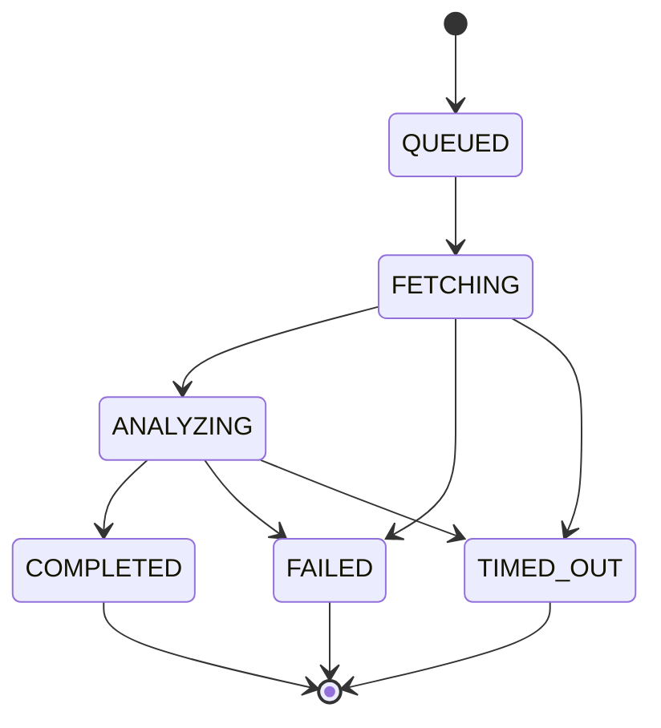
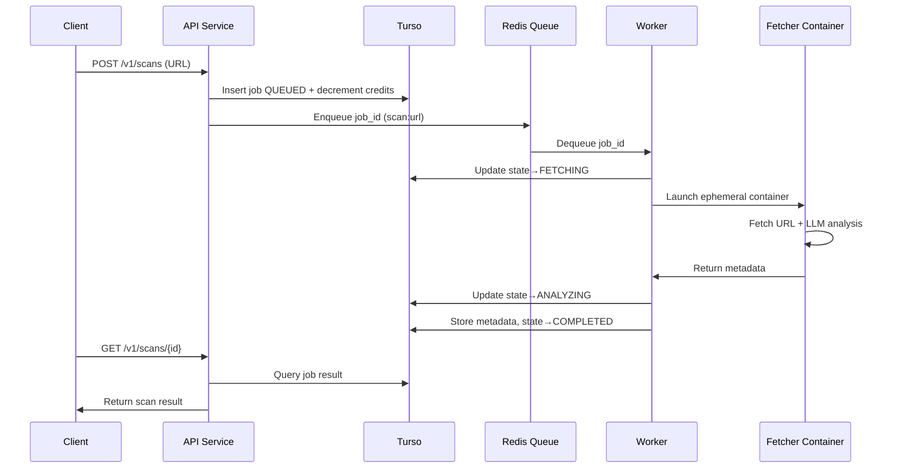

# SafeURL.ai — System Architecture

SafeURL.ai is an open-source, asynchronous, AI-powered URL safety screening service built with isolation, privacy, and developer-friendliness at its core.
It evaluates URLs using ephemeral containers, LLM analysis, and a Redis-backed job queue, while persisting only metadata in Turso.

---

## 1. Goals & Requirements

### Core Product Goals

- AI-driven, high-quality URL safety assessment.
- Designed for privacy: no content persisted, metadata only.
- Robust asynchronous workflow with queue + worker system.
- Ephemeral, isolated URL fetch execution for security.
- Fully containerized architecture.
- Developer-friendly API, CLI, and MCP server.

### Technical Requirements

- Open-source with IP-protective license (recommended: BSL).
- OAuth2/OIDC authentication via Clerk.
- Primary DB: Turso (libSQL) with Drizzle ORM for type-safe, schema-driven access.
- Queue: Redis using BullMQ (Bun-compatible).
- All services implemented in TypeScript/Bun (API, workers, fetcher).
- Dashboard + MCP server in TypeScript/Bun.
- Pluggable LLM providers (OpenAI, DeepSeek, Kami, OSS models).
- Crypto payments + credit-based billing.
- Local development using Docker + Tilt.

---

## 2. High-Level Architecture


---

## 3. Component Breakdown

### 3.1 API Service (Bun + TypeScript)

**Responsibilities:**

- Validates Clerk-issued JWTs.
- Exposes:

* POST /v1/scans
* GET /v1/scans/:id
* credit balance endpoints
* webhook management
  - Writes job rows to Turso via Drizzle ORM.
  - Pushes queued tasks into Redis (BullMQ).
  - Stateless, horizontally scalable.
  - Built with Bun's native HTTP server for high performance.
  - Type-safe database operations with Drizzle's TypeScript-first API.

---

### 3.2 Turso Database (libSQL + Drizzle ORM)

**Stores durable state:**

- Users (Clerk user IDs)
- Credits (wallets)
- Scan jobs + state
- Result metadata:

* categories
* risk score
* model used
* content_hash
* http status, headers, etc.

**Database Layer:**

- Drizzle ORM for type-safe, schema-driven database access
- Schema migrations managed via Drizzle Kit
- Full TypeScript type inference for queries and results
- Optimistic concurrency control via Drizzle transactions
- libSQL driver for Turso compatibility
- Global low-latency access via Turso's edge replication

All state transitions use Drizzle transactions with optimistic concurrency to preserve state integrity.

---

### 3.3 Redis Queue (BullMQ)

**Handles async workflow:**

- Job dispatch (scan:url)
- Retries + exponential backoff
- Dead-letter queues
- Visibility timeouts
- Horizontal scaling via worker concurrency
- TypeScript-first API, fully compatible with Bun

**SaaS-friendly:** Upstash / Redis Cloud.

---

### 3.4 Worker Service (Bun + TypeScript)

**Key functions:**

- Dequeues tasks from Redis (BullMQ).
- Claims scan job from Turso via Drizzle ORM.
- Performs state transitions:

* QUEUED → FETCHING
* FETCHING → ANALYZING
* ANALYZING → COMPLETED
  - Spawns ephemeral fetcher containers using Docker SDK (via `dockerode` or Bun-native Docker API).
  - Collects fetcher results & LLM output.
  - Stores metadata in Turso using Drizzle ORM with type safety.
  - Leverages Bun's fast runtime and native async capabilities.

---

### 3.5 Ephemeral Fetcher Container (Bun + TypeScript)

Launched per scan.

**Inside the container:**

- Strict-timeout URL fetcher (using Bun's native fetch)
- SSRF-safe networking
- Optional screenshot or rendered DOM extraction (via Puppeteer/Playwright)
- LLM provider call via adapters
- Output returned via:

* stdout JSON, or
* internal service callback

Container always runs as `--rm`, leaving no state behind.
Built with Bun for fast startup and execution.

---

### 3.6 LLM Provider Adapter Layer

**Unified interface:**

```typescript
interface AIClient {
  analyzeURL(ctx: Context, fetch: FetchResult): Promise<AnalysisResult>;
}
```

**Providers:**

- OpenAI (Vision)
- DeepSeek
- Kami
- Ollama (local)
- Custom threat-model fine-tuned LLMs

All adapters implemented in TypeScript, leveraging Bun's native fetch and Web APIs.

---

### 3.7 Dashboard (Next.js + Clerk + Bun)

**Provides:**

- Scan history
- Real-time job updates
- API keys
- Credit balance
- Crypto payments
- Developer tools

Runs on Bun runtime for optimal performance and fast hot reloading.

---

### 3.8 MCP Server (Bun + TypeScript)

**Tools for agents & dev tools:**

- `scan_url(url)`
- `get_scan_status(jobId)`
- `get_url_report(jobId)`

Thin wrapper over the public API.
Built with Bun for fast startup and low latency.

---

## 4. State Machine



**Rules:**

- Only valid transitions allowed.
- Prevents concurrency races between workers.
- Each step is updated atomically via Drizzle transactions in Turso.

---

## 5. Job Lifecycle (Sequence)



---

## 6. Development Environment

### Tools

- Docker
- Tilt (live reload)
- Turso local dev
- Redis local container
- Bun runtime (all services: API, worker, fetcher)
- Next.js dashboard (Bun runtime)
- MCP server (Bun)

### Local services via Tilt

- localhost:8080 — API
- localhost:3000 — Dashboard
- localhost:6379 — Redis
- turso file — local database

---

## 7. Licensing

**Recommended:**

**Business Source License (BSL 1.1)**

- Protects SaaS offering
- Source available for all users
- Automatically becomes Apache 2.0 after X years

---

## 8. Future Extensions

- Batch scanning endpoints
- Domain intelligence & aggregated risk scoring
- Browser extension for real-time scanning
- SIEM / SOC integrations
- Attachment/file scanning
- Custom fine-tuned LLM optimized for web threat detection
- Queue partitioning for high-volume enterprise customers

---

## 9. Proposed Repository Structure

```
safeurl/
├── api/              # Bun HTTP API (TypeScript)
├── worker/           # Bun worker + BullMQ (TypeScript)
├── fetcher/          # Ephemeral fetcher (Bun + TypeScript)
├── dashboard/        # Next.js + Clerk (Bun runtime)
├── mcp-server/       # Bun MCP server (TypeScript)
├── db/               # Drizzle schema + migrations (Turso/libSQL)
├── infra/
│   ├── docker/
│   ├── tilt/
│   └── k8s/
└── docs/
    └── safeurl_architecture.md
```
